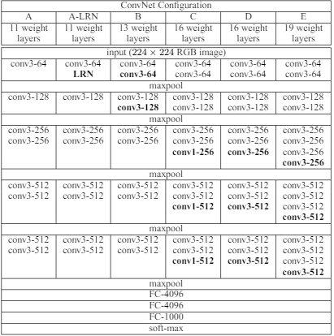

<h1>VGG16 Model for Image Classification</h1>

Objective of this project: To understand the model architecture of a VGG16 model as stated in the paper published: [Very Deep Convolutional Networks for Large-Scale Image Recognition by Karen Simonyan & Andrew Zisserman](https://arxiv.org/abs/1409.1556)

As stated in the paper, the VGG16 model has been trained on the ImageNet dataset. The model is used for image classification and object detection. However, in this project, I have only used the model for image classification currently.

The model archetecture derived from the paper is shown below:

<b>The custom VGG16 model that is used in this project is based in model E of the paper.</b>

<h3>Key takeaways from the model archetecture:</h3>

The model consist of 5 convolutional blocks. Each block consists of 2-4 convolutional layers and 1 max pooling layer. Each convolutional layer has a 3x3 kernel, padding of 1 and stride of 1 to keep the spatial dimensions unchanged.

The model is followed by 3 fully connected layers and a softamx function at the end. The last fully connected layer depends on the number of classes in the dataset (120, 200 and 1000 classes in my experiments).

Datasets used:

- [ImageNet 1000 (mini)](https://www.kaggle.com/datasets/ifigotin/imagenetmini-1000)

ImageNet 1000 mini is a dataset of 1000 images and their corresponding labels. Due to sheer size of the original Imagenet dataset originally presented containing 160GB+ of images, it would be impractical to use the full Imagenet dataset. Hence, I have used this dataset for this project. Which still consist of 1000 classes but fewer images per class. The trade offs will be discussed in the notebook.

- [Stanford Dog Dataset](https://www.kaggle.com/datasets/jessicali9530/stanford-dogs-dataset)

The Stanford Dogs dataset contains images of 120 breeds of dogs from around the world. This dataset has been built using images and annotation from ImageNet for the task of fine-grained image categorization. It was originally collected for fine-grain image categorization, a challenging problem as certain dog breeds have near identical features or differ in colour and age.

<h3>Experiments Done:</h3>

First, I used a custom implementation of the VGG16 model E to predict 1000 classes of the image in ImageNet 1000. The validation accuracy of the model achieved is 0.75% which is very low.

Afterwards, I reduced the number of classes to 200. The validation accuracy of the model achieved is 0.76% which is still very low.

Next, using the Stanford Dogs dataset, the validation accuracy of the model achieved is 0.74% which is still very low. The reason for changing dataset was because the number of images per class in ImageNet 1000 was roughly 30-40, which is considerably low and insufficient for a model to capture the nuances of the image in each class. The Stanford Dogs dataset has 120 classes and 150+ images per class.

Afterwards, I made a comparision between my own implementation of the VGG16 model E and the [pretrained VGG16 model](https://pytorch.org/vision/main/models/generated/torchvision.models.vgg16.html) that can be found in the pytorch library. The model achieved a validation accuracy of 63% which is far better than the custom implementation of the VGG16 model that I used.

- Key reasons for difference in accuracy:
  1. VGG16 model in pytorch has been pretrained before on ImageNet images while mine has weights that are randomly initialised.
  2. The VGG16 model that is in pytorch has a slightly different archetecture compared to the one that is stated in the paper.

Following that, I also made comparisions with the [pretrained ResNet50 model](https://pytorch.org/vision/main/models/generated/torchvision.models.resnet50.html) that can also be found in the pytorch library. The model achieved a validation accuracy of 68%. ResNet models will be experimented in the future.

Here is the comparisions of the validation accuracies between my implementation of the VGG16 model, the pretrained VGG16 model and the pretrained ResNet50 model:

